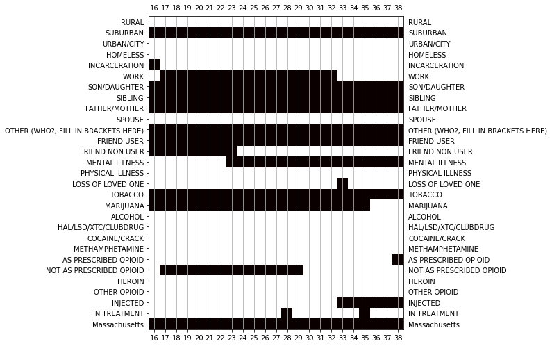
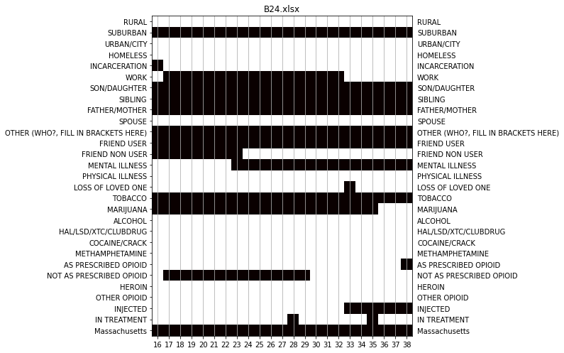

- [Introduction](#introduction)
- [Installation](#installation)
- [Getting some resources](#getting-some-resources)
- [Poking around](#poking-around)
  * [df_store](#df-store)
  * [Viewing trajectories](#viewing-trajectories)
    + [Viewing a single trajectory](#viewing-a-single-trajectory)
    + [Flip over all (or some) trajectories](#flip-over-all--or-some--trajectories)
  * [Making a pdf of trajectories](#making-a-pdf-of-trajectories)
  * [Demo s and v](#demo-s-and-v)
  * [cstore](#cstore)
  * [pstore](#pstore)
  * [Scrap place](#scrap-place)
- [Potential Calculus Experimentations](#potential-calculus-experimentations)
- [Extra scrap](#extra-scrap)
- [Acknowledgements](#acknowledgements)
  * [National Institutes of Health, National Institute on Drug Abuse](#national-institutes-of-health--national-institute-on-drug-abuse)
  * [National Institutes of Health, National Institute on Drug Abuse,     American Recovery and Reinvestment Act](#national-institutes-of-health--national-institute-on-drug-abuse------american-recovery-and-reinvestment-act)
  * [National Addiction & HIV Data Archive Program (NAHDAP)](#national-addiction---hiv-data-archive-program--nahdap-)

<small><i><a href='http://ecotrust-canada.github.io/markdown-toc/'>Table of contents generated with markdown-toc</a></i></small>

# Introduction

ODUS (for Older Drug User Study) contains data and tools to study the drug use of older drug users.

Essentially, there are these are tools:

- To get prepared data on the 119 "trajectories" describing 31 variables (drug use, social, etc.) over time of 119 different respondents.

- To vizualize these trajectories in various ways

- To create pdfs of any selection of these trajectories and variables

- To make count tables for any combinations of the variables: Essential step of any Markovian or Bayesian analysis.

- To make probability (joint or conditional) tables from any combination of the variables

- To operate on these count and probability tables, thus enabling inference operations


# Installation

You need to have python 3.7+ to run this notebook.

And you'll need to have `odus`, which you get by doing

```
pip install odus
```

(And if you don't have pip then, well... how to put it... ha ha ha!)

But if you're the type, you can also just get the source from `https://github.com/thorwhalen/odus`. 

Oh, and pull requests etc. are welcome!

Stars, likes, references, and coffee also welcome.

A simple flowchart about the architecture:


# Getting some resources


```python
from matplotlib.pylab import *
from numpy import *
import seaborn as sns

import os
from py2store.stores.local_store import RelativePathFormatStore
from py2store.mixins import ReadOnlyMixin
from py2store.base import Store


from io import BytesIO
from spyn.ppi.pot import Pot, ProbPot
from collections import UserDict, Counter
import numpy as np
import pandas as pd

from ut.ml.feature_extraction.sequential_var_sets import PVar, VarSet, DfData, VarSetFactory
from IPython.display import Image

from odus.analysis_utils import *

from odus.dacc import DfStore, counts_of_kps, Dacc, VarSetCountsStore, \
    mk_pvar_struct, PotStore, _commun_columns_of_dfs, Struct, mk_pvar_str_struct, VarStr

from odus.plot_utils import plot_life_course
```


```python
from odus import data_dir, data_path_of
survey_dir = data_dir
data_dir
```


    '/D/Dropbox/dev/p3/proj/odus/odus/data'


```python
df_store = DfStore(data_dir + '/{}.xlsx')
len(df_store)
cstore = VarSetCountsStore(df_store)
v = mk_pvar_struct(df_store, only_for_cols_in_all_dfs=True)
s = mk_pvar_str_struct(v)
f, df = cstore.df_store.head()
pstore = PotStore(df_store)
```

# Poking around

## df_store

A df_store is a key-value store where the key is the xls file and the value is the prepared dataframe


```python
len(df_store)
```


    119


```python
it = iter(df_store.values())
for i in range(5):  # skip five first
    _ = next(it)
df = next(it)  # get the one I want
df.head(3)
```


<div>
<style scoped>
    .dataframe tbody tr th:only-of-type {
        vertical-align: middle;
    }

    .dataframe tbody tr th {
        vertical-align: top;
    }

    .dataframe thead th {
        text-align: right;
    }
</style>
<table border="1" class="dataframe">
  <thead>
    <tr style="text-align: right;">
      <th>category</th>
      <th>RURAL</th>
      <th>SUBURBAN</th>
      <th>URBAN/CITY</th>
      <th>HOMELESS</th>
      <th>INCARCERATION</th>
      <th>WORK</th>
      <th>SON/DAUGHTER</th>
      <th>SIBLING</th>
      <th>FATHER/MOTHER</th>
      <th>SPOUSE</th>
      <th>...</th>
      <th>METHAMPHETAMINE</th>
      <th>AS PRESCRIBED OPIOID</th>
      <th>NOT AS PRESCRIBED OPIOID</th>
      <th>HEROIN</th>
      <th>OTHER OPIOID</th>
      <th>INJECTED</th>
      <th>IN TREATMENT</th>
      <th>Selects States below</th>
      <th>Georgia</th>
      <th>Pennsylvania</th>
    </tr>
    <tr>
      <th>age</th>
      <th></th>
      <th></th>
      <th></th>
      <th></th>
      <th></th>
      <th></th>
      <th></th>
      <th></th>
      <th></th>
      <th></th>
      <th></th>
      <th></th>
      <th></th>
      <th></th>
      <th></th>
      <th></th>
      <th></th>
      <th></th>
      <th></th>
      <th></th>
      <th></th>
    </tr>
  </thead>
  <tbody>
    <tr>
      <th>11</th>
      <td>0</td>
      <td>1</td>
      <td>0</td>
      <td>0</td>
      <td>0</td>
      <td>0</td>
      <td>1</td>
      <td>1</td>
      <td>0</td>
      <td>0</td>
      <td>...</td>
      <td>0</td>
      <td>0</td>
      <td>0</td>
      <td>0</td>
      <td>0</td>
      <td>0</td>
      <td>0</td>
      <td>1</td>
      <td>1</td>
      <td>0</td>
    </tr>
    <tr>
      <th>12</th>
      <td>0</td>
      <td>1</td>
      <td>0</td>
      <td>0</td>
      <td>0</td>
      <td>0</td>
      <td>1</td>
      <td>1</td>
      <td>0</td>
      <td>0</td>
      <td>...</td>
      <td>0</td>
      <td>1</td>
      <td>0</td>
      <td>0</td>
      <td>0</td>
      <td>0</td>
      <td>0</td>
      <td>1</td>
      <td>1</td>
      <td>0</td>
    </tr>
    <tr>
      <th>13</th>
      <td>0</td>
      <td>1</td>
      <td>0</td>
      <td>0</td>
      <td>0</td>
      <td>0</td>
      <td>1</td>
      <td>1</td>
      <td>0</td>
      <td>0</td>
      <td>...</td>
      <td>0</td>
      <td>0</td>
      <td>0</td>
      <td>0</td>
      <td>0</td>
      <td>0</td>
      <td>0</td>
      <td>1</td>
      <td>1</td>
      <td>0</td>
    </tr>
  </tbody>
</table>
<p>3 rows × 31 columns</p>
</div>


```python
print(df.columns.values)
```

    ['RURAL' 'SUBURBAN' 'URBAN/CITY' 'HOMELESS' 'INCARCERATION' 'WORK'
     'SON/DAUGHTER' 'SIBLING' 'FATHER/MOTHER' 'SPOUSE'
     'OTHER (WHO?, FILL IN BRACKETS HERE)' 'FRIEND USER' 'FRIEND NON USER'
     'MENTAL ILLNESS' 'PHYSICAL ILLNESS' 'LOSS OF LOVED ONE' 'TOBACCO'
     'MARIJUANA' 'ALCOHOL' 'HAL/LSD/XTC/CLUBDRUG' 'COCAINE/CRACK'
     'METHAMPHETAMINE' 'AS PRESCRIBED OPIOID' 'NOT AS PRESCRIBED OPIOID'
     'HEROIN' 'OTHER OPIOID' 'INJECTED' 'IN TREATMENT' 'Selects States below'
     'Georgia' 'Pennsylvania']


```python
t = df[['ALCOHOL', 'TOBACCO']]
t.head(3)
```


<div>
<style scoped>
    .dataframe tbody tr th:only-of-type {
        vertical-align: middle;
    }

    .dataframe tbody tr th {
        vertical-align: top;
    }

    .dataframe thead th {
        text-align: right;
    }
</style>
<table border="1" class="dataframe">
  <thead>
    <tr style="text-align: right;">
      <th>category</th>
      <th>ALCOHOL</th>
      <th>TOBACCO</th>
    </tr>
    <tr>
      <th>age</th>
      <th></th>
      <th></th>
    </tr>
  </thead>
  <tbody>
    <tr>
      <th>11</th>
      <td>0</td>
      <td>0</td>
    </tr>
    <tr>
      <th>12</th>
      <td>0</td>
      <td>0</td>
    </tr>
    <tr>
      <th>13</th>
      <td>0</td>
      <td>0</td>
    </tr>
  </tbody>
</table>
</div>


```python
c = Counter()
for i, r in t.iterrows():
    c.update([tuple(r.to_list())])
c
```


    Counter({(0, 0): 6, (1, 0): 4, (1, 1): 9, (0, 1): 2})


```python
def count_tuples(dataframe):
    c = Counter()
    for i, r in dataframe.iterrows():
        c.update([tuple(r.to_list())])
    return c
```


```python
fields = ['ALCOHOL', 'TOBACCO']
# do it for every one
c = Counter()
for df in df_store.values():
    c.update(count_tuples(df[fields]))
c
```


    Counter({(0, 1): 903, (1, 1): 1343, (0, 0): 240, (1, 0): 179})


```python
pd.Series(c)
```


    0  1     903
    1  1    1343
    0  0     240
    1  0     179
    dtype: int64


```python
# Powerful! You can use that with several pairs and get some nice probabilities. Look up Naive Bayes.
```

## Viewing trajectories


```python
import itertools
from functools import partial
from odus.util import write_images
from odus.plot_utils import plot_life, life_plots, write_trajectories_to_file

ihead = lambda it: itertools.islice(it, 0, 5)
```

### Viewing a single trajectory


```python
k = next(iter(df_store))  # get the first key
print(f"k: {k}")  # print it
plot_life(df_store[k])  # plot the trajectory
```

    k: surveys/B24.xlsx





```python
plot_life(df_store[k], fields=[s.in_treatment, s.injected])  # only want two fields
```


### Flip over all (or some) trajectories


```python
gen = life_plots(df_store)
```


```python
next(gen)  # launch to get the next trajectory
```


    <matplotlib.axes._subplots.AxesSubplot at 0x12b21f070>





Get three trajectories, but only over two fields.


```python
# fields = [s.in_treatment, s.injected]
fields = [s.physical_illness, s.as_prescribed_opioid, s.heroin, s.other_opioid]
keys = list(df_store)[:10]
# print(f"keys={keys}")
axs = [x for x in life_plots(df_store, fields, keys=keys)];
```


## Making a pdf of trajectories


```python
write_trajectories_to_file(df_store, fields, keys, fp='three_respondents_two_fields.pdf');
```


```python
write_trajectories_to_file(df_store, fp='all_respondents_all_fields.pdf');
```


```python
 
```

## Demo s and v


```python
print(list(filter(lambda x: not x.startswith('__'), dir(s))))
```

    ['alcohol', 'as_prescribed_opioid', 'cocaine_crack', 'father_mother', 'hal_lsd_xtc_clubdrug', 'heroin', 'homeless', 'in_treatment', 'incarceration', 'injected', 'loss_of_loved_one', 'marijuana', 'mental_illness', 'methamphetamine', 'not_as_prescribed_opioid', 'other_opioid', 'physical_illness', 'rural', 'sibling', 'son_daughter', 'suburban', 'tobacco', 'urban_city', 'work']


```python
s.heroin
```


    'HEROIN'


```python
v.heroin
```


    PVar('HEROIN', 0)


```python
v.heroin - 1
```


    PVar('HEROIN', -1)


## cstore


```python
# cstore[v.alcohol, v.tobacco]
cstore[v.as_prescribed_opioid-1, v.heroin]
```


    Counter({(0, 0): 1026, (1, 0): 264, (0, 1): 1108, (1, 1): 148})


```python
pd.Series(cstore[v.as_prescribed_opioid-1, v.heroin])
```


    0  0    1026
    1  0     264
    0  1    1108
    1  1     148
    dtype: int64


```python
cstore[v.alcohol, v.tobacco, v.heroin]
```


    Counter({(0, 0, 1): 427,
             (1, 0, 1): 656,
             (1, 1, 1): 687,
             (0, 0, 0): 189,
             (0, 1, 1): 476,
             (0, 1, 0): 51,
             (1, 0, 0): 133,
             (1, 1, 0): 46})


```python
cstore[v.alcohol-1, v.alcohol]
```


    Counter({(0, 0): 994, (1, 1): 1375, (1, 0): 90, (0, 1): 87})


```python
cstore[v.alcohol-1, v.alcohol, v.tobacco]
```


    Counter({(0, 0, 1): 807,
             (1, 1, 1): 1220,
             (1, 0, 0): 26,
             (0, 1, 1): 76,
             (0, 0, 0): 187,
             (1, 1, 0): 155,
             (0, 1, 0): 11,
             (1, 0, 1): 64})


```python
t = pd.Series(cstore[v.alcohol-1, v.alcohol, v.tobacco])
t.loc[t.index]
```


    <pandas.core.indexing._LocIndexer at 0x130955db0>


## pstore


```python
t = pstore[s.alcohol-1, s.alcohol]
t
```


                       pval
    ALCOHOL-1 ALCOHOL      
    0         0         994
              1          87
    1         0          90
              1        1375


```python
t.tb
```


<div>
<style scoped>
    .dataframe tbody tr th:only-of-type {
        vertical-align: middle;
    }

    .dataframe tbody tr th {
        vertical-align: top;
    }

    .dataframe thead th {
        text-align: right;
    }
</style>
<table border="1" class="dataframe">
  <thead>
    <tr style="text-align: right;">
      <th></th>
      <th>ALCOHOL-1</th>
      <th>ALCOHOL</th>
      <th>pval</th>
    </tr>
  </thead>
  <tbody>
    <tr>
      <th></th>
      <td>0</td>
      <td>0</td>
      <td>994</td>
    </tr>
    <tr>
      <th></th>
      <td>0</td>
      <td>1</td>
      <td>87</td>
    </tr>
    <tr>
      <th></th>
      <td>1</td>
      <td>0</td>
      <td>90</td>
    </tr>
    <tr>
      <th></th>
      <td>1</td>
      <td>1</td>
      <td>1375</td>
    </tr>
  </tbody>
</table>
</div>


```python
t / []
```


                           pval
    ALCOHOL-1 ALCOHOL          
    0         0        0.390416
              1        0.034171
    1         0        0.035350
              1        0.540063


```python
t[s.alcohol-1]
```


               pval
    ALCOHOL-1      
    0          1081
    1          1465


```python
t / t[s.alcohol-1]  # cond prob!
```


                           pval
    ALCOHOL-1 ALCOHOL          
    0         0        0.919519
              1        0.080481
    1         0        0.061433
              1        0.938567


```python
tt = pstore[s.alcohol, s.tobacco]
tt
```


                     pval
    ALCOHOL TOBACCO      
    0       0         240
            1         903
    1       0         179
            1        1343


```python
tt / tt[s.alcohol]
```


                         pval
    ALCOHOL TOBACCO          
    0       0        0.209974
            1        0.790026
    1       0        0.117608
            1        0.882392


```python
tt / tt[s.tobacco]
```


                         pval
    ALCOHOL TOBACCO          
    0       0        0.572792
    1       0        0.427208
    0       1        0.402048
    1       1        0.597952


```python

```

## Scrap place


```python
t = pstore[s.as_prescribed_opioid-1, s.heroin-1, s.heroin]
t

```


                                            pval
    AS PRESCRIBED OPIOID-1 HEROIN-1 HEROIN      
    0                      0        0        927
                                    1        172
                           1        0         99
                                    1        936
    1                      0        0        249
                                    1         33
                           1        0         15
                                    1        115


```python
tt = t / t[s.as_prescribed_opioid-1, s.heroin-1]  # cond prob!
tt
```


                                                pval
    AS PRESCRIBED OPIOID-1 HEROIN-1 HEROIN          
    0                      0        0       0.843494
                                    1       0.156506
                           1        0       0.095652
                                    1       0.904348
    1                      0        0       0.882979
                                    1       0.117021
                           1        0       0.115385
                                    1       0.884615


```python
tt.tb
```


<div>
<style scoped>
    .dataframe tbody tr th:only-of-type {
        vertical-align: middle;
    }

    .dataframe tbody tr th {
        vertical-align: top;
    }

    .dataframe thead th {
        text-align: right;
    }
</style>
<table border="1" class="dataframe">
  <thead>
    <tr style="text-align: right;">
      <th></th>
      <th>AS PRESCRIBED OPIOID-1</th>
      <th>HEROIN-1</th>
      <th>HEROIN</th>
      <th>pval</th>
    </tr>
  </thead>
  <tbody>
    <tr>
      <th></th>
      <td>0</td>
      <td>0</td>
      <td>0</td>
      <td>0.843494</td>
    </tr>
    <tr>
      <th></th>
      <td>0</td>
      <td>0</td>
      <td>1</td>
      <td>0.156506</td>
    </tr>
    <tr>
      <th></th>
      <td>0</td>
      <td>1</td>
      <td>0</td>
      <td>0.095652</td>
    </tr>
    <tr>
      <th></th>
      <td>0</td>
      <td>1</td>
      <td>1</td>
      <td>0.904348</td>
    </tr>
    <tr>
      <th></th>
      <td>1</td>
      <td>0</td>
      <td>0</td>
      <td>0.882979</td>
    </tr>
    <tr>
      <th></th>
      <td>1</td>
      <td>0</td>
      <td>1</td>
      <td>0.117021</td>
    </tr>
    <tr>
      <th></th>
      <td>1</td>
      <td>1</td>
      <td>0</td>
      <td>0.115385</td>
    </tr>
    <tr>
      <th></th>
      <td>1</td>
      <td>1</td>
      <td>1</td>
      <td>0.884615</td>
    </tr>
  </tbody>
</table>
</div>


```
AS PRESCRIBED OPIOID-1	HEROIN-1	HEROIN	
0	0	0	0.843494
0	0	1	0.156506
1	0	0	0.882979
1	0	1	0.117021
```


```python
0.117021 / 0.156506
```


    0.7477093529960512


```python

```


```python
prob_of_heroin_given_presc_op = 0.359223
prob_of_heroin_given_not_presc_op = 0.519213

prob_of_heroin_given_presc_op / prob_of_heroin_given_not_presc_op
```


    0.6918605658949217


```python
prob_of_heroin_given_not_presc_op / prob_of_heroin_given_presc_op
```


    1.4453779407220584


# Potential Calculus Experimentations


```python
# survey_dir = '/D/Dropbox/others/Miriam/python/ProcessedSurveys'
df_store = DfStore(survey_dir + '/{}.xlsx')
len(df_store)
```


    119


```python
cstore = VarSetCountsStore(df_store)
v = mk_pvar_struct(df_store, only_for_cols_in_all_dfs=True)
s = mk_pvar_str_struct(v)
f, df = cstore.df_store.head()
df.head(3)
```


<div>
<style scoped>
    .dataframe tbody tr th:only-of-type {
        vertical-align: middle;
    }

    .dataframe tbody tr th {
        vertical-align: top;
    }

    .dataframe thead th {
        text-align: right;
    }
</style>
<table border="1" class="dataframe">
  <thead>
    <tr style="text-align: right;">
      <th>category</th>
      <th>RURAL</th>
      <th>SUBURBAN</th>
      <th>URBAN/CITY</th>
      <th>HOMELESS</th>
      <th>INCARCERATION</th>
      <th>WORK</th>
      <th>SON/DAUGHTER</th>
      <th>SIBLING</th>
      <th>FATHER/MOTHER</th>
      <th>SPOUSE</th>
      <th>...</th>
      <th>HAL/LSD/XTC/CLUBDRUG</th>
      <th>COCAINE/CRACK</th>
      <th>METHAMPHETAMINE</th>
      <th>AS PRESCRIBED OPIOID</th>
      <th>NOT AS PRESCRIBED OPIOID</th>
      <th>HEROIN</th>
      <th>OTHER OPIOID</th>
      <th>INJECTED</th>
      <th>IN TREATMENT</th>
      <th>Massachusetts</th>
    </tr>
    <tr>
      <th>age</th>
      <th></th>
      <th></th>
      <th></th>
      <th></th>
      <th></th>
      <th></th>
      <th></th>
      <th></th>
      <th></th>
      <th></th>
      <th></th>
      <th></th>
      <th></th>
      <th></th>
      <th></th>
      <th></th>
      <th></th>
      <th></th>
      <th></th>
      <th></th>
      <th></th>
    </tr>
  </thead>
  <tbody>
    <tr>
      <th>16</th>
      <td>0</td>
      <td>1</td>
      <td>0</td>
      <td>0</td>
      <td>1</td>
      <td>0</td>
      <td>1</td>
      <td>1</td>
      <td>1</td>
      <td>0</td>
      <td>...</td>
      <td>0</td>
      <td>0</td>
      <td>0</td>
      <td>0</td>
      <td>0</td>
      <td>0</td>
      <td>0</td>
      <td>0</td>
      <td>0</td>
      <td>1</td>
    </tr>
    <tr>
      <th>17</th>
      <td>0</td>
      <td>1</td>
      <td>0</td>
      <td>0</td>
      <td>0</td>
      <td>1</td>
      <td>1</td>
      <td>1</td>
      <td>1</td>
      <td>0</td>
      <td>...</td>
      <td>0</td>
      <td>0</td>
      <td>0</td>
      <td>0</td>
      <td>1</td>
      <td>0</td>
      <td>0</td>
      <td>0</td>
      <td>0</td>
      <td>1</td>
    </tr>
    <tr>
      <th>18</th>
      <td>0</td>
      <td>1</td>
      <td>0</td>
      <td>0</td>
      <td>0</td>
      <td>1</td>
      <td>1</td>
      <td>1</td>
      <td>1</td>
      <td>0</td>
      <td>...</td>
      <td>0</td>
      <td>0</td>
      <td>0</td>
      <td>0</td>
      <td>1</td>
      <td>0</td>
      <td>0</td>
      <td>0</td>
      <td>0</td>
      <td>1</td>
    </tr>
  </tbody>
</table>
<p>3 rows × 29 columns</p>
</div>


```python
cstore = VarSetCountsStore(df_store)
cstore.mk_pvar_attrs()
```


```python
from odus.dacc import DfStore, counts_of_kps, Dacc, plot_life_course, VarSetCountsStore, mk_pvar_struct, PotStore
pstore = PotStore(df_store)
pstore.mk_pvar_attrs()
p = pstore[v.homeless - 1, v.incarceration]
p
```


                              pval
    HOMELESS-1 INCARCERATION      
    0          0              1690
               1               577
    1          0               192
               1                87


```python
p / []
```


                                  pval
    HOMELESS-1 INCARCERATION          
    0          0              0.663786
               1              0.226630
    1          0              0.075412
               1              0.034171


```python
pstore[v.incarceration]
```


                   pval
    INCARCERATION      
    0              1989
    1               676


```python
pstore[v.alcohol-1, v.loss_of_loved_one]
```


                                 pval
    ALCOHOL-1 LOSS OF LOVED ONE      
    0         0                   990
              1                    91
    1         0                  1321
              1                   144


```python
tw = pstore[v.tobacco, v.work]
mw = pstore[v.marijuana, v.work]
aw = pstore[v.alcohol, v.work]
w = pstore[v.work]

```


```python
evid_t = Pot.from_hard_evidence(**{s.tobacco: 1})
evid_m = Pot.from_hard_evidence(**{s.marijuana: 1})
evid_a = Pot.from_hard_evidence(**{s.alcohol: 1})
evid_a
```


             pval
    ALCOHOL      
    1           1


```python
aw
```


                  pval
    ALCOHOL WORK      
    0       0      431
            1      712
    1       0      448
            1     1074


```python
w / []
```


              pval
    WORK          
    0     0.329831
    1     0.670169


```python
(evid_m * mw) / []
```


                        pval
    MARIJUANA WORK          
    1         0     0.350603
              1     0.649397


```python
(evid_t * tw) / []
```


                      pval
    TOBACCO WORK          
    1       0     0.313001
            1     0.686999


```python
(evid_a * aw) / []
```


                     pval
    ALCOHOL WORK         
    1       0     0.29435
            1     0.70565


# Extra scrap


```python
# from graphviz import Digraph
# Digraph(body="""
# raw -> data -> count -> prob
# raw [label="excel files (one per respondent)" shape=folder]
# data [label="dataframes" shape=folder]
# count [label="counts for any combinations of the variables in the data" shape=box3d]
# prob [label="probabilities for any combinations of the variables in the data" shape=box3d]
# """.split('\n'))
```

# Acknowledgements

This study was supported by the National Institutes of Drug Abuse R15DA041657 and R21DA025298, and . 
The content is solely the responsibility of the authors and does not necessarily represent 
the official views of the National Institute on Drug Abuse or the National Institutes of Health. 

Here are the grant numbers you worked on I think there are only two plus the one you got as PI from NAHDAP

## National Institutes of Health, National Institute on Drug Abuse
```
2017-2020        
    1 R15 DA041657 
    Miriam Boeri, Aukje Lamonica, MPIs
    Award: $341,565
    “Suburban Opioid Study” (SOS) 

```

## National Institutes of Health, National Institute on Drug Abuse,     American Recovery and Reinvestment Act

```
2009-2011        
    R21DA025298   
    Miriam Boeri, PI          
    Thor Whalen, Co-investigator
    Award: $367,820
    “Older Drug Users: A Life Course Study of Turning Points in Drug Use and Injection.”
```

## National Addiction & HIV Data Archive Program (NAHDAP)
```
2010-2011        
    University of Michigan’s Inter-university Consortium for Political and Social                              
    Research (ICPSR) 
    Thor Whalen, PI
    Data archived at http://dx.doi.org/10.3886/ICPSR34296.v1
```